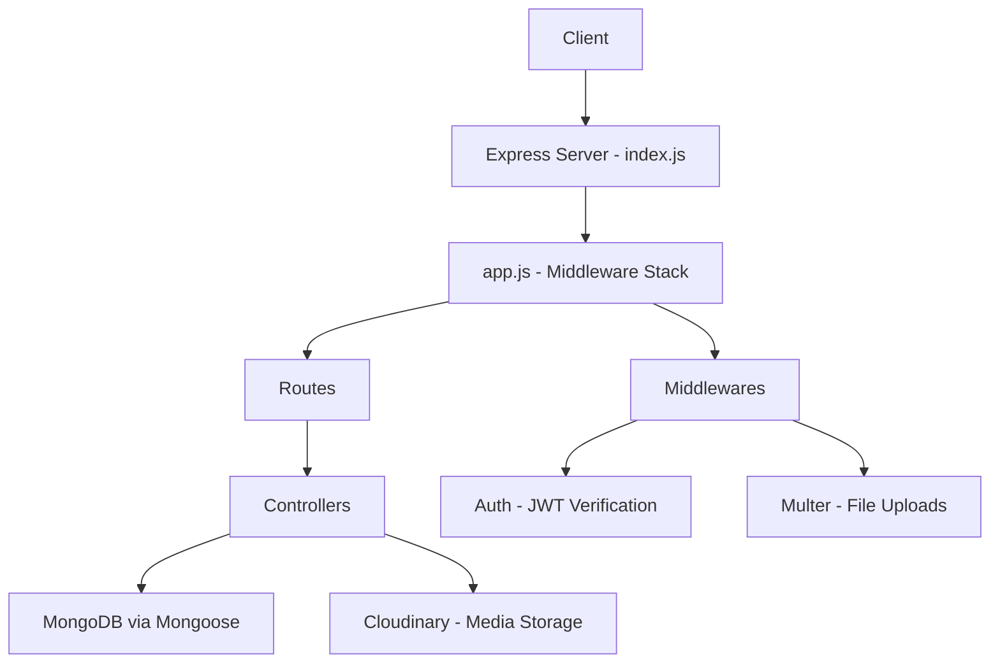

# 🔍 Streaming Platform — Full Project Audit

## Architecture Overview



| Layer | Files | Status |
|-------|-------|--------|
| Entry Point | [index.js](file:///Users/jeel/Desktop/streaming_platform/src/index.js) | ⚠️ Minor issues |
| App Setup | [app.js](file:///Users/jeel/Desktop/streaming_platform/src/app.js) | ✅ Good |
| Database | [db/index.js](file:///Users/jeel/Desktop/streaming_platform/src/db/index.js) | ⚠️ Typo |
| Models | 7 files in `/models` | 🔴 Syntax errors |
| Controllers | [user.controller.js](file:///Users/jeel/Desktop/streaming_platform/src/controllers/user.controller.js) | ⚠️ Logic bugs |
| Routes | [user.routes.js](file:///Users/jeel/Desktop/streaming_platform/src/routes/user.routes.js) | ✅ Good |
| Middlewares | auth + multer | ✅ Good |
| Utilities | ApiError, ApiResponse, asyncHandler, cloudinary | ⚠️ Minor issues |

---

## 🔴 CRITICAL — Syntax Errors (App Won't Start)

These bugs will **crash the server** on startup.

### 1. `require()` used in ES Module files

The project uses `"type": "module"` in [package.json](file:///Users/jeel/Desktop/streaming_platform/package.json#L7), meaning ALL files use ES Module syntax (`import`/`export`). But several model files use `require()` which will crash:

| File | Line | Problem |
|------|------|---------|
| [video.model.js](file:///Users/jeel/Desktop/streaming_platform/src/models/video.model.js#L1) | 1 | `const mongoose ,{Schema}= require('mongoose')` — invalid syntax + `require` |
| [video.model.js](file:///Users/jeel/Desktop/streaming_platform/src/models/video.model.js#L8) | 8 | `const mongooseaggregatePaginate = require(...)` — `require` in ESM |
| [comment.js](file:///Users/jeel/Desktop/streaming_platform/src/models/comment.js#L1) | 1 | `const mongoose ,{Schema}= require('mongoose')` — invalid syntax + `require` |
| [comment.js](file:///Users/jeel/Desktop/streaming_platform/src/models/comment.js#L2) | 2 | `const mongooseaggregatePaginate = require(...)` — `require` in ESM |
| [likes.js](file:///Users/jeel/Desktop/streaming_platform/src/models/likes.js#L1) | 1 | `const {mongoose, Schema}= require('mongoose')` — `require` in ESM |
| [likes.js](file:///Users/jeel/Desktop/streaming_platform/src/models/likes.js#L2) | 2 | `const comment = require('./comment')` — `require` in ESM |
| [tweet.js](file:///Users/jeel/Desktop/streaming_platform/src/models/tweet.js#L1) | 1 | `const mongoose ,{Schema}= require('mongoose')` — invalid syntax + `require` |

> [!CAUTION]
> The `const mongoose ,{Schema}= require(...)` syntax is **doubly broken**: (1) you can't destructure with `const a, {b} = ...` — it should be `const { default: mongoose, Schema } = ...` or better yet use `import`, and (2) `require()` doesn't work in ES modules. These files won't parse at all.

### 2. Variable name mismatch in [video.model.js](file:///Users/jeel/Desktop/streaming_platform/src/models/video.model.js#L61)

```diff
- videoSchema.plugin(mongooseaggregatePaginate)
+ VideoSchema.plugin(mongooseaggregatePaginate)
```
Schema is defined as `VideoSchema` (capital V) but the plugin is applied to `videoSchema` (lowercase v) — `ReferenceError`.

### 3. Cloudinary import issue in [cloudinary.js](file:///Users/jeel/Desktop/streaming_platform/src/utils/cloudinary.js#L2-L3)

```javascript
import {v2} from "cloudinary";     // imports v2 but never uses it
import cloudinary from "cloudinary"; // imports default — this is the v1 API
```
The `cloudinary.config()` and `cloudinary.uploader.upload()` calls use the v1 default import. Should consistently use `v2`.

---

## 🟠 Logic Bugs (Runtime Errors)

### 4. Missing `await` in [refreshAcessToken](file:///Users/jeel/Desktop/streaming_platform/src/controllers/user.controller.js#L191)

```diff
- const user= User.findById(decodedToken.id);
+ const user= await User.findById(decodedToken.id);
```
Without `await`, `user` is a Query object (truthy), so the null check below it never works and the token comparison will fail.

### 5. Destructuring mismatch in [refreshAcessToken](file:///Users/jeel/Desktop/streaming_platform/src/controllers/user.controller.js#L209)

```diff
- const {accessToken, newrefreshToken} = await generateAccessAndRefreshTokens(user._id);
+ const {accessToken, refreshToken} = await generateAccessAndRefreshTokens(user._id);
```
The function returns `{accessToken, refreshToken}` but the code destructures `newrefreshToken`, which will be `undefined`. The refreshed token cookie will be set to `undefined`.

### 6. Missing `await` in [updateCurrentUserDetails](file:///Users/jeel/Desktop/streaming_platform/src/controllers/user.controller.js#L280)

```diff
- const user = User.findByIdAndUpdate(...)
+ const user = await User.findByIdAndUpdate(...)
```
Returns a Query object instead of the updated user document.

### 7. Wrong property for file access in [updateUserAvatar](file:///Users/jeel/Desktop/streaming_platform/src/controllers/user.controller.js#L297) & [updateUserCoverImage](file:///Users/jeel/Desktop/streaming_platform/src/controllers/user.controller.js#L343)

```diff
- const AvatarLocalPath = req.files?.path;        // ❌ req.files is array, has no .path
+ const AvatarLocalPath = req.file?.path;          // ✅ upload.single() puts file at req.file

- const coverImageLocalPath = req.files?.path;     // ❌ same issue
+ const coverImageLocalPath = req.file?.path;      // ✅
```
When using `upload.single()`, the file is at `req.file`, not `req.files`.

### 8. Double token generation on login — [user.controller.js L124](file:///Users/jeel/Desktop/streaming_platform/src/controllers/user.controller.js#L124)

```diff
- await generateAccessAndRefreshTokens(user._id)       // ← called but result thrown away
  const {accessToken, refreshToken} = await generateAccessAndRefreshTokens(user._id)
```
`generateAccessAndRefreshTokens` is called **twice** — first on L124 (result discarded) then again on L126. This wastes a DB write and creates an orphaned refresh token.

### 9. `timestamps` inside schema body in [subscription.model.js](file:///Users/jeel/Desktop/streaming_platform/src/models/subscription.model.js#L14)

```diff
  const subscriptionSchema = new Schema({
    subscriber: { ... },
    channel: { ... },
-   timestamps: true,       // ❌ This becomes a regular field named "timestamps"
- });
+ }, {
+   timestamps: true        // ✅ Must be in the options object (2nd argument)
+ });
```

### 10. Like model — all fields marked `required: true`

In [likes.js](file:///Users/jeel/Desktop/streaming_platform/src/models/likes.js#L5-L27), `video`, `comment`, `tweet`, and `likeby` are ALL required. But a like should target **one** of video/comment/tweet, not all three simultaneously. This makes it impossible to like just a video without providing a comment and tweet ID.

### 11. Cover image crash in [registerUser](file:///Users/jeel/Desktop/streaming_platform/src/controllers/user.controller.js#L56)

```javascript
const coverImageLocalPath = req.files?.coverImage[0]?.path;
```
If `coverImage` is not uploaded, `req.files?.coverImage` is `undefined`, and `undefined[0]` throws a `TypeError`. Should be:
```javascript
const coverImageLocalPath = req.files?.coverImage?.[0]?.path;
```

---

## 🟡 Security Vulnerabilities

### 12. 🔴 `.env` file exposed with real credentials

> [!CAUTION]
> The [.env](file:///Users/jeel/Desktop/streaming_platform/.env) file contains **real MongoDB connection string, Cloudinary API keys, and JWT secrets**. While `.gitignore` lists `.env`, if this was ever committed to git history, these credentials are compromised. **Rotate all secrets immediately** if this repo has ever been pushed.

### 13. `dotenv` path is wrong in [index.js](file:///Users/jeel/Desktop/streaming_platform/src/index.js#L9)

```diff
  dotenv.config({
-   path: './env'      // ❌ missing the dot — looks for file named "env"
+   path: './.env'     // ✅ correct path
  })
```
The app likely works because `nodemon -r dotenv/config` in the dev script loads `.env` before `index.js` runs, but this config line itself is wrong.

### 14. No rate limiting on auth routes

Login, register, and refresh-token endpoints have no rate limiting — vulnerable to brute force attacks.

### 15. No input validation/sanitization

No validation library (like `joi`, `zod`, or `express-validator`) is used. Fields like email aren't validated for format, passwords have no minimum length requirement.

### 16. Multer has no file size/type restrictions

[multer.middleware.js](file:///Users/jeel/Desktop/streaming_platform/src/middlewares/multer.middleware.js) accepts ANY file type and ANY size. Should restrict to images for avatar/cover and add file size limits.

### 17. File naming collision risk

```javascript
filename: function (req, file, cb) {
    cb(null, file.originalname)  // Two users uploading "photo.jpg" will overwrite each other
}
```
Should use unique filenames (e.g., `Date.now() + '-' + file.originalname` or UUID).

---

## 🔵 Missing Features (Only User Controller Exists)

The project has models for Videos, Comments, Likes, Playlists, Tweets, and Subscriptions, but **only the User controller and routes are implemented**. The following are completely missing:

| Feature | Model Exists | Controller | Routes |
|---------|:---:|:---:|:---:|
| User Management | ✅ | ✅ | ✅ |
| Video CRUD (upload, edit, delete, list) | ✅ | ❌ | ❌ |
| Comments (add, edit, delete, list) | ✅ | ❌ | ❌ |
| Likes (like/unlike video/comment/tweet) | ✅ | ❌ | ❌ |
| Playlists (create, add videos, manage) | ✅ | ❌ | ❌ |
| Tweets/Posts (create, edit, delete) | ✅ | ❌ | ❌ |
| Subscriptions (subscribe/unsubscribe) | ✅ | ❌ | ❌ |
| Video Search | ❌ | ❌ | ❌ |
| Video Streaming/Playback | ❌ | ❌ | ❌ |

---

## 🟣 Code Quality Issues

### 18. No global error handler
The `asyncHandler` catches errors and passes them to `next()`, but there's no global error-handling middleware in [app.js](file:///Users/jeel/Desktop/streaming_platform/src/app.js) to format `ApiError` into proper HTTP responses. Unhandled errors will return Express's default HTML error page.

### 19. Duplicate `express.json()` middleware
- [app.js L17](file:///Users/jeel/Desktop/streaming_platform/src/app.js#L17): `app.use(express.json({limit:"16kb"}))`
- [index.js L6](file:///Users/jeel/Desktop/streaming_platform/src/index.js#L6): `app.use(express.json())` — this **overrides** the 16kb limit from app.js with no limit.

### 20. Typo: `moongoose` → `mongoose` in [db/index.js](file:///Users/jeel/Desktop/streaming_platform/src/db/index.js#L2)

```diff
- import moongoose from "mongoose";
+ import mongoose from "mongoose";
```
(Works because the import name is just a local variable, but it's confusing.)

### 21. No temp file cleanup on failed uploads
If Cloudinary upload fails but `fs.unlinkSync` also fails (file doesn't exist), the error is swallowed. Over time, `/public/temp` can accumulate orphaned files.

### 22. Inconsistent naming conventions
- `getwatchHostory` — typo in "History" + camelCase inconsistent
- `ispublished` vs `isPublished`
- `likeby` vs `likedBy`
- `fullname` vs `fullName`
- `avtarLocalPath` — typo for "avatar"

---

## 📋 Recommended Fix Priority

### Phase 1 — Fix Critical Syntax Errors (App Can't Start)
1. Convert all `require()` to `import` in model files
2. Fix `const mongoose ,{Schema}=` destructuring syntax
3. Fix `videoSchema` → `VideoSchema` variable name
4. Fix Cloudinary import to consistently use v2

### Phase 2 — Fix Logic Bugs
5. Add missing `await` in `refreshAcessToken` and `updateCurrentUserDetails`
6. Fix `req.files?.path` → `req.file?.path` for single uploads
7. Fix destructuring mismatch (`newrefreshToken` → `refreshToken`)
8. Remove duplicate `generateAccessAndRefreshTokens` call on login
9. Fix `timestamps` placement in subscription model
10. Fix Like model — make video/comment/tweet optional
11. Fix optional chaining for coverImage in register
12. Fix dotenv path and remove duplicate express.json()

### Phase 3 — Security Hardening
13. Add rate limiting (express-rate-limit)
14. Add input validation (zod or joi)
15. Add file type/size restrictions to Multer
16. Add unique filenames for uploads
17. Add global error handling middleware
18. Rotate exposed credentials

### Phase 4 — Build Missing Features
19. Video controller + routes (upload, CRUD, streaming)
20. Comment controller + routes
21. Like controller + routes
22. Playlist controller + routes
23. Tweet controller + routes
24. Subscription controller + routes
25. Search functionality

### Phase 5 — Your Planned AI Features
26. 🤖 Thumbnail suggestion agent
27. 🤖 Video summary agent
28. 📊 Recommendation algorithm

---

## 💡 Additional Feature Suggestions

| Feature | Description | Impact |
|---------|-------------|--------|
| **Video Transcription** | Auto-generate transcripts using Whisper API | Enables search, accessibility, summaries |
| **Content Moderation Agent** | AI agent to flag inappropriate content | Trust & Safety |
| **Analytics Dashboard** | View counts, watch time, engagement metrics | Creator tools |
| **Notification System** | Real-time notifications for subs, comments, likes | User engagement |
| **Video Categories/Tags** | Tagging system for content organization | Better discovery |
| **Live Streaming** | WebSocket-based live streaming support | Premium feature |
| **Monetization** | Ad integration, channel memberships | Revenue |
| **Multi-quality Streaming** | HLS/DASH adaptive bitrate streaming | Better UX |
| **Content Delivery** | CDN integration for faster video delivery | Performance |
| **Email Verification** | Verify email on registration | Security |

---

> [!IMPORTANT]
> **Next Steps**: Let me know if you'd like me to start fixing the critical bugs (Phase 1 & 2) first, or if you have questions about any of the findings. Once the foundation is solid, we can move on to building the AI agents (thumbnail suggestion, video summary) and the recommendation algorithm.
